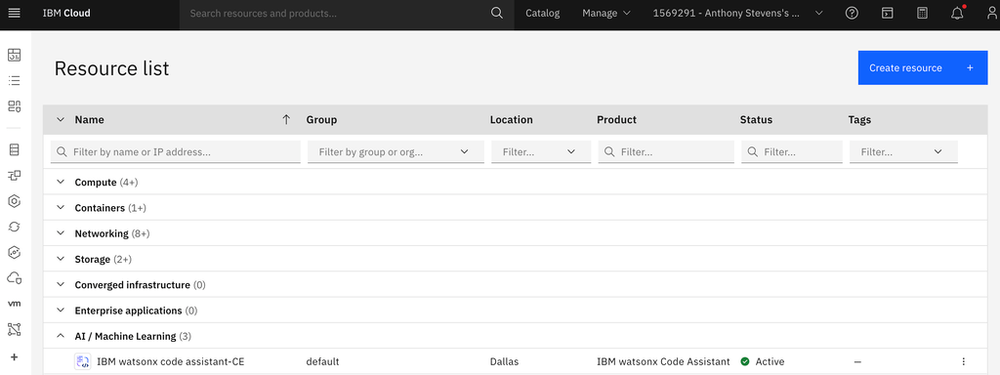
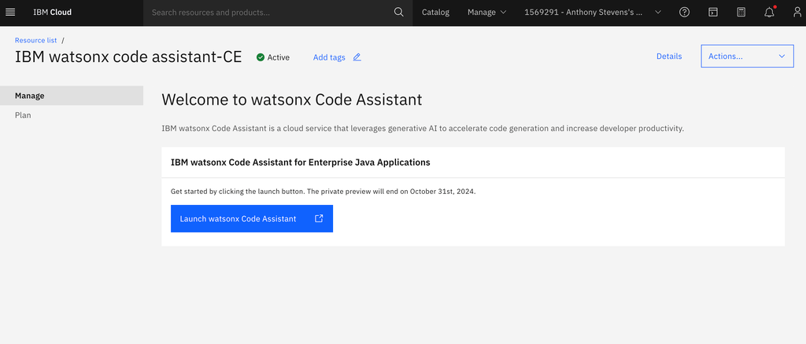
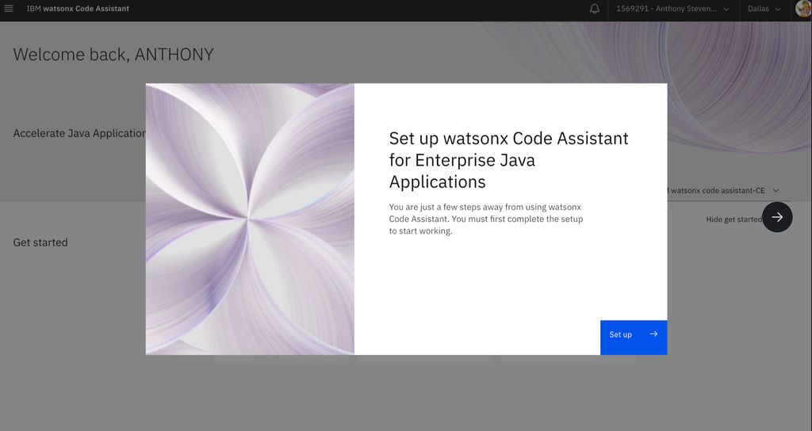
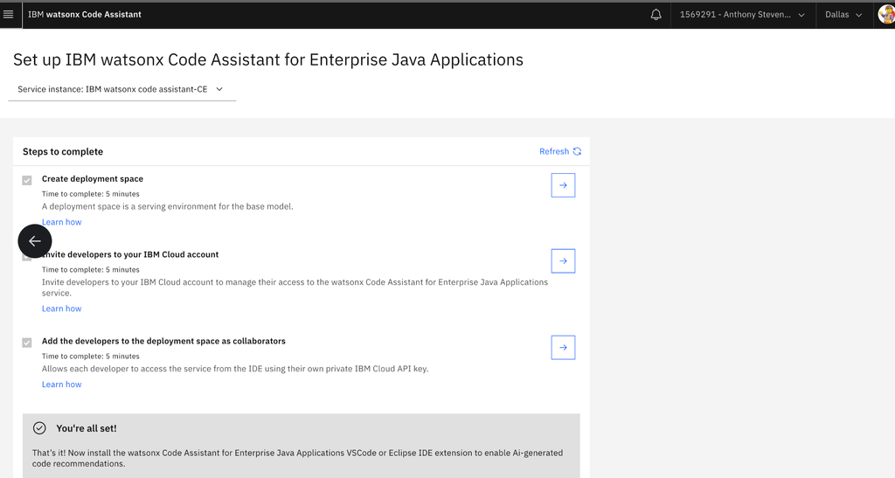
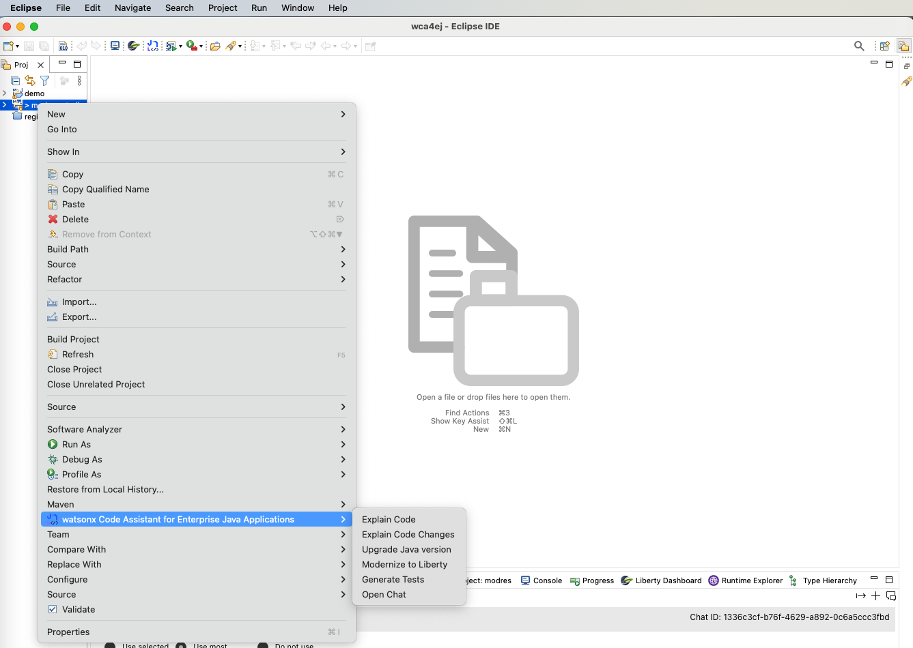

# Installation guide for wca4ej 

This document gives infomration on installing software tools/IDE that are needed to run ***Watson Code Assistant For Enterprise Java*** **(Wca4ej)**
## Environment setup 

### 1. Java installation

Install Java21 using this link [Download Java](https://www.oracle.com/sg/java/technologies/downloads/)
> Note: After installing java,add java to `PATH` variable and set `JAVA_HOME` envitonment variable
### 2. Install Maven

- Windows
    - Visit the official Maven website: [Maven Download Page](https://maven.apache.org/download.cgi)
    - Under "Files", click on the binary zip archive link (e.g., apache-maven-x.x.x-bin.zip). 
    - Extract the zip file to a location of your choice, e.g., C:\Program Files\Apache\maven.
    - Add Maven to PATH and Set MAVEN_HOME variable 
- Mac
   - Install maven using homebrew

### 3. Install Eclipse

Eclipse users must install one of these two packages:
   - Eclipse IDE for Java Developers
   - Eclipse IDE for Enterprise Java and Web Developers 

Below are the links for eclipse installation
- [Eclipse 2024-03](https://www.eclipse.org/downloads/packages/release/2024-03/r)
- [Eclipse 2023-12](https://www.eclipse.org/downloads/packages/release/2023-12/r)

### 4. Download Wca4ej extension

Download the latest WCA4EJ Code Eclipse Extension and install by following these instructions: [Wca4ej Extension](https://early-access.ibm.com/software/support/trial/cst/welcomepage.wss?siteId=2044)

> Note: If you see a yellow warning: checking file that doesn’t go away; hit refresh & try again

### 5. Techozone environment 
You can reserve an instance in techzone by using this [Techzone Link](https://techzone.ibm.com/collection/wca4eja/environments).

After reserving the instance, you can accept the invitation sent to your email and then create an API key using below steps.

1. Go to cloud.ibm.com to create an API key for later use in WCA:
2. Look at the top menu bar and click on Manage > Access (IAM) > API keys.
3. Click Create an IBM Cloud API key.
4. Enter a name and description for your API key.
5. Click Create.
6. Then, click Show to display the API key or click Copy to copy
7. Save this API Key for later entry into the WCA plugin for Eclipse

Next go to cloud.ibm.com/resources and expand the "AI/Machine Learning" group then click on “wca4eja - primary”:

Click on the Launch watsonx Code Assistant button

If you see the screen below, click Setup.

In the next screen, you can follow the instructions for the first checkmark to create your own Deployment Space:

Ignore the 2nd and 3rd checkmark.  Do not invite users to your IBM Cloud account nor to your Deployment space.

Now, you are ready to use your API key in the Eclipse plugin.

### 6. Installing Wca4ej extension

After downloding the extension from **Step 4** and getting API key from **Step 5** install the wca4ej using eclipse as shown below 

Choose the loacl package or archive and provide the path where the extension files are downloaded from **Step 4** 

After the software (extension gets installed), restart your IDE. After restart, navigate to below setting 

Then choose the Watson code assistant for enterprise java as below

After this, you will be navigated to below screen, input the API key created in **Step 5**

### 7. Installing Liberty Tools

Install the liberty tools from eclipse market place as shown below [Help >> Eclipse Marketplace]

Now, you can start using wca4ej

You can import the existing maven project, after that based on the your requirement, choose the feature you need.

