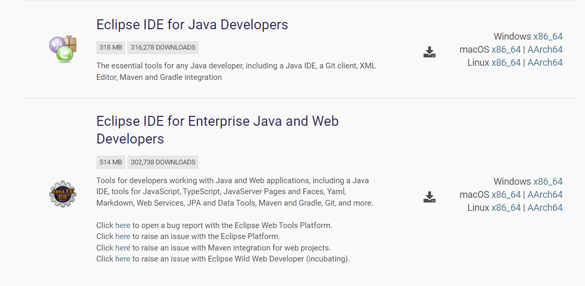
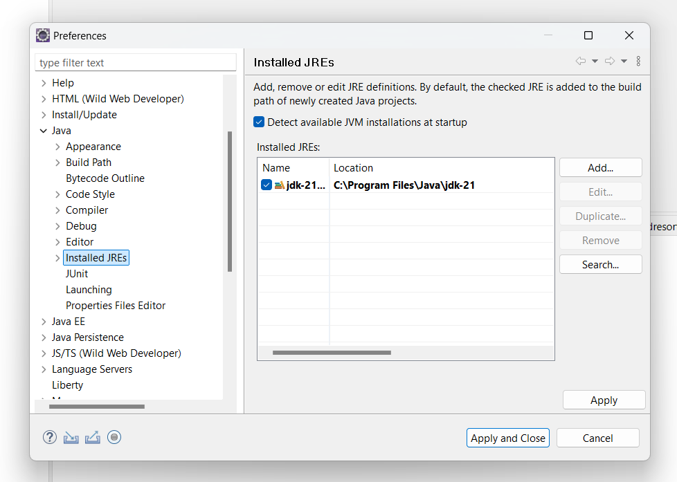
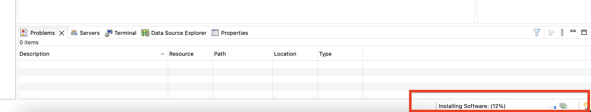

# Installation guide for wca4ej 

This document gives infomration on installing software tools/IDE that are needed to run ***Watson Code Assistant For Enterprise Java*** **(Wca4ej)**
## Environment setup 

### 1. Java installation

#### Install Java21 using this link [Download Java](https://www.oracle.com/sg/java/technologies/downloads/)
- Check if Java is installed properly:
```bash
java --version
```

- After installing java, add java to `PATH` variable and set `JAVA_HOME` envitonment variable
- **For Mac**:
  - Open .zshrc or .bash_profile
      ```bash
      nano ~/.zshrc
      ```
  - Add the following lines
      ```bash
      export JAVA_HOME=/Library/Java/JavaVirtualMachines/<java version>/Contents/Home
      ```
      ```bash
      export PATH=$JAVA_HOME/bin:$PATH
      ```
  - Save the file and exit (press CTRL + X, then Y, and hit Enter)
  - Reload the shell configuration so the changes take effect.
      ```bash
      source ~/.zshrc
      ```
  - Verify the JAVA_HOME with the following command:
      ```bash
      echo $JAVA_HOME
      ```
- **For Windows**:
  - Open Environment variables using windows search bar
  - Set JAVA_HOME variable using Environment variables:
    ```bash
    JAVA_HOME= C:\Program Files\Java\jdk-21
    ```
    
  - Add Java to PATH using Environment variables: 
    ```bash
    C:\Program Files\Java\jdk-21\bin
    ```


### 2. Install Maven

- **For Windows**
    - Visit the official Maven website: [Maven Download Page](https://maven.apache.org/download.cgi)
    - Under "Files", click on the binary zip archive link (e.g., apache-maven-x.x.x-bin.zip). 
    - Extract the zip file to a location of your choice, e.g., C:\Apache\maven.
    - Set MAVEN_HOME variable using Environment variables:
      ```bash
      MAVEN_HOME= <path-to-folder>\maven\apache-maven-3.9.9-bin\apache-maven-3.9.9
      ```
    - Add Maven to PATH using Environment variables: 
      ```bash
      <path-to-folder>\maven\apache-maven-3.9.9-bin\apache-maven-3.9.9\bin
      ```
- **For Mac**
   - Install maven using homebrew
      ```bash
      brew install maven
      ```
   - Check if maven is installed properly:
      ```bash
      mvn --version
      ```


### 3. Install Eclipse

Eclipse users must install one of these two packages:
   - Eclipse IDE for Enterprise Java and Web Developers _(preferred)_
   - Eclipse IDE for Java Developers


Below are the links for eclipse installation
- [Eclipse 2023-12](https://www.eclipse.org/downloads/packages/release/2023-12/r) _(preferred)_
- [Eclipse 2024-03](https://www.eclipse.org/downloads/packages/release/2024-03/r)
  

After installation, open Eclipse:
- **For Mac**,
  - Move **Eclipse.app** to **Application**
  - Open a terminal, navigate to the Application, and open Eclipse from there using following command: 
    ```bash
    open /Applications/Eclipse.app
    ```

- **For Windows**,
  - You can just click on the Eclipse app icon to open it directly.





### 4. Configure Java21 in Eclipse
If for some reason Eclipse doesn’t automatically detect your Java 21 installation, first try restarting it. Else:

- Go to Window > Preferences (for the windows) **OR** Eclipse > Settings (for the mac).
- Expand the Java section and click on Installed JREs.
- Make sure to select Java21, if already present in the options and click Apply and Close
- Else, Click Add and select Standard VM.
- Browse to the folder where your Java 21 is installed (typically C:\Program Files\Java\jdk-21).
- Select the JDK and click Finish.



### 5. Download Wca4ej extension

Download the latest WCA4EJ Code Eclipse Extension and install by following these instructions: [Wca4ej Extension](https://ibm.box.com/s/ybfq51npx0rd6m0ft30dwokjno7w3fmn)

- If using Windows OS, the Windows plugin requires the [Microsoft Edge WebView2 runtime](https://developer.microsoft.com/en-us/microsoft-edge/webview2/?form=MA13LH). 
- Scroll down and choose Evergreen Standalone Installer. 
- In newer versions of Windows this might already be installed. In that case, you will receive this message while installing.


### 6. Installing Wca4ej extension


#### After downloding the extension from **Step 5** install the wca4ej using eclipse as shown below 


#### Choose the local package or archive and provide the path where the extension files are downloaded from **Step 4** 
- Enter a name in the Name field, then click **Add**.
- Click the check box for the plugin, then click **Next**.
- On Install Details, review the items, then click **Next**.
- On Review Licenses, read the license, click to agree, then click **Finish**.
- On Trust Artifacts, click the **Type** check box, then click **Trust Selected**.
- **IMPORTANT**: Do not close eclipse until Installing Software progress bar completes in the **right bottom**.
  




#### After the software (extension gets installed), restart your Eclipse IDE. After restart, navigate to below setting 


#### Then choose the 'Chat' feature of Watson code assistant for enterprise java as below


#### After this, you will be navigated to below screen [the API key will be provided to you later during the workshop].


#### If you face issues while entering the API key, close the Eclipse, run the following command in terminal and open your eclipse again.
  ```bash
  rm -rf ~/.eclipse/org.eclipse.equinox.security/secure_storage
  ```

**Note:** For the first time, after we add our API key, a window will prompt to store a master password. Select **Yes** and fill the security questions with any default vaules. 


### 7. Installing Liberty Tools

Install the liberty tools from eclipse market place as shown below [Help >> Eclipse Marketplace]


Now, you can start using wca4ej after getting the API key.


