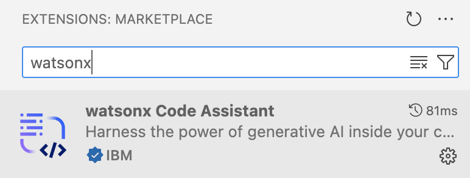
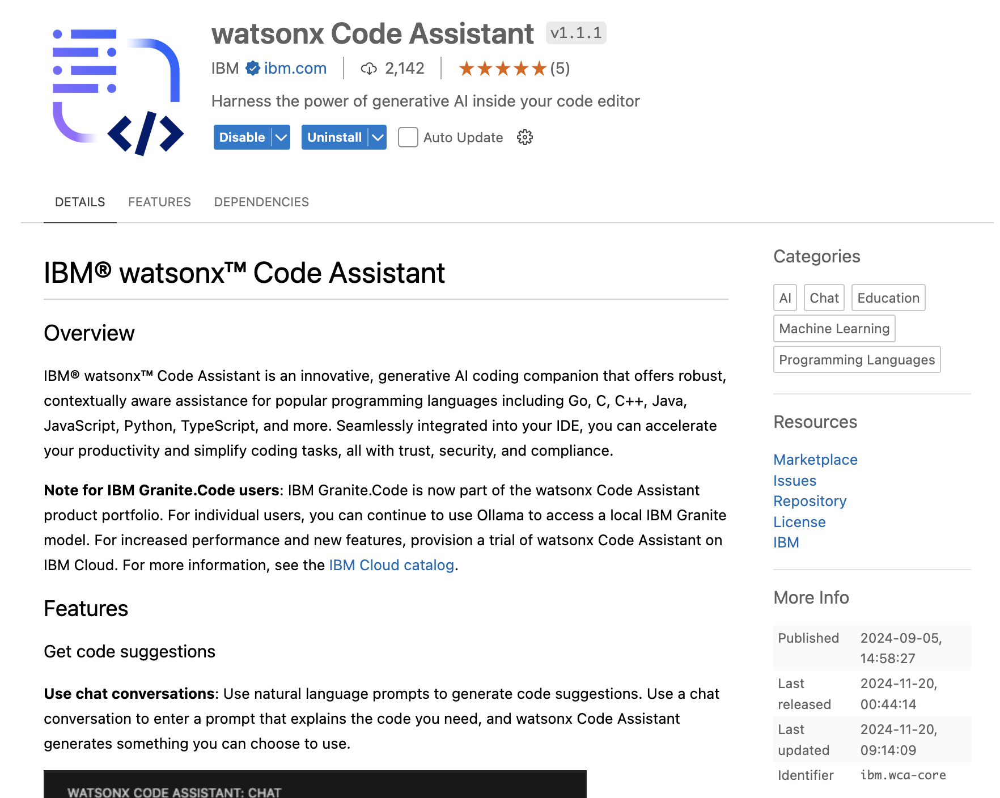
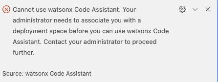

# Watsonx Code Assistant 在 Visual Studio Code 內安裝指南

本文檔提供安使用 IDE VSCode 安裝運行 ***Watson Code Assistant*** **(WCA Core)**。
最後更新: Nov 20th, 2024

### 1. 安裝 VS Code

- 請瀏覽[VSCode 官方網頁](https://code.visualstudio.com/download) 下載並安裝 VS Code 於主機。

### 2. 下載 WCA extension

請在VS Code內的Marketplace 下載 watsonx Code Assistant extension。

請點擊 "Install"/”安裝“

之後您會看到有關產品頁面。

### 4. WCA API 鎖

目前為止， WCA API鎖會由IBM內部分發。請向有關IBM人員協助您得到API鎖。

- 如果有需要，請重啟 VS Code。

- 在 VS Code的左下方，可以應用您得到的WCA API鎖登入軟件。

- 若登入的過程中發現有這個問題 - **"administrator needs to associate you with a deployment space"**, 請告知IBM人員請他們從新為這組API鎖建設 deployment space。

### 8. 開始應用 WCA

為了審核API鎖是否正常操作，請到 **watsonx Code Assistant** 選項卡然後選擇聊天頁面。若成功與語言模型對話，代表API鎖是正常操作。

