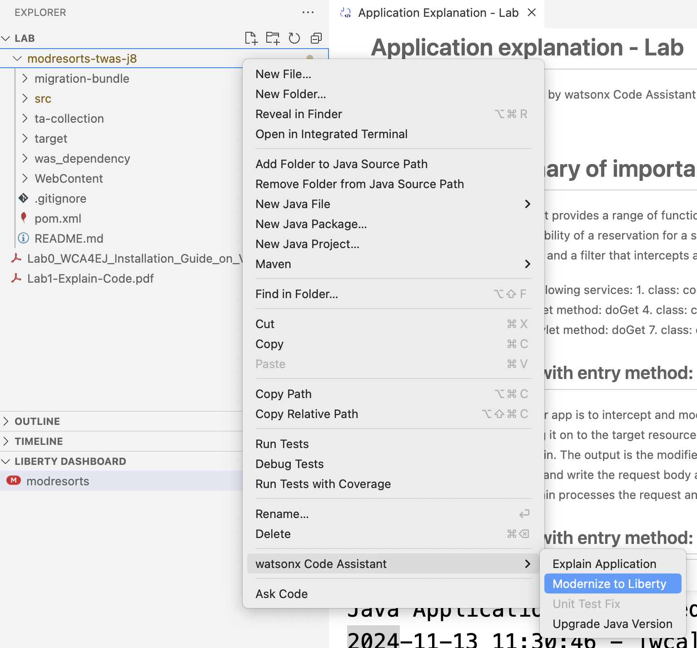
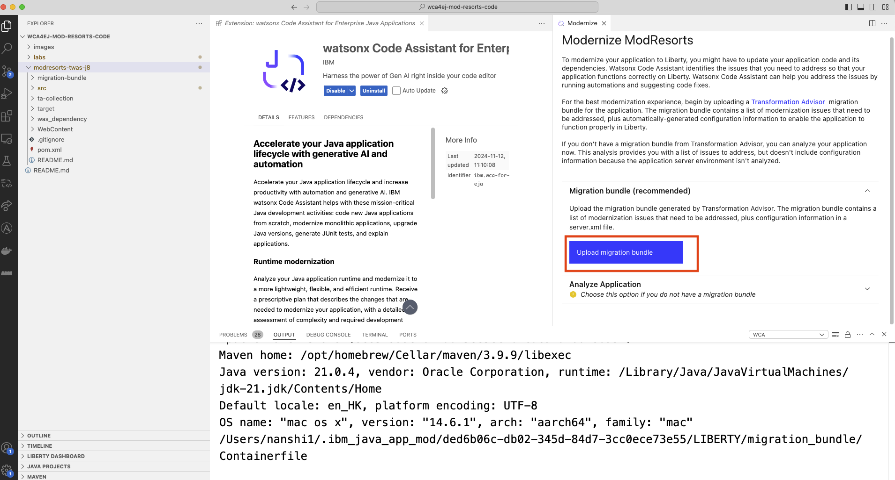
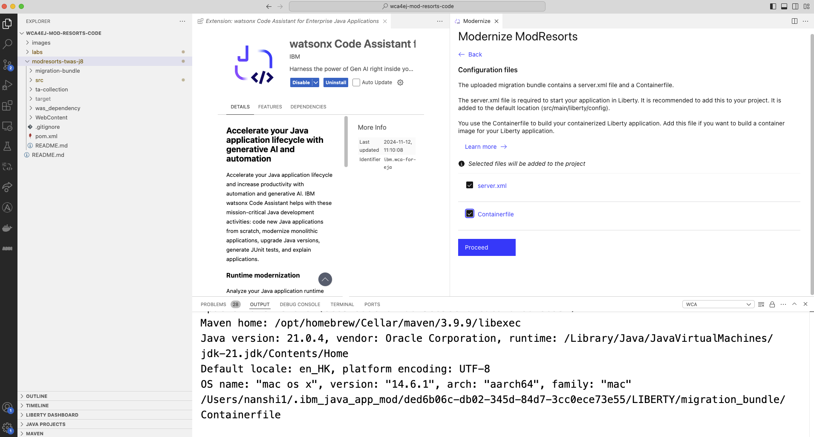
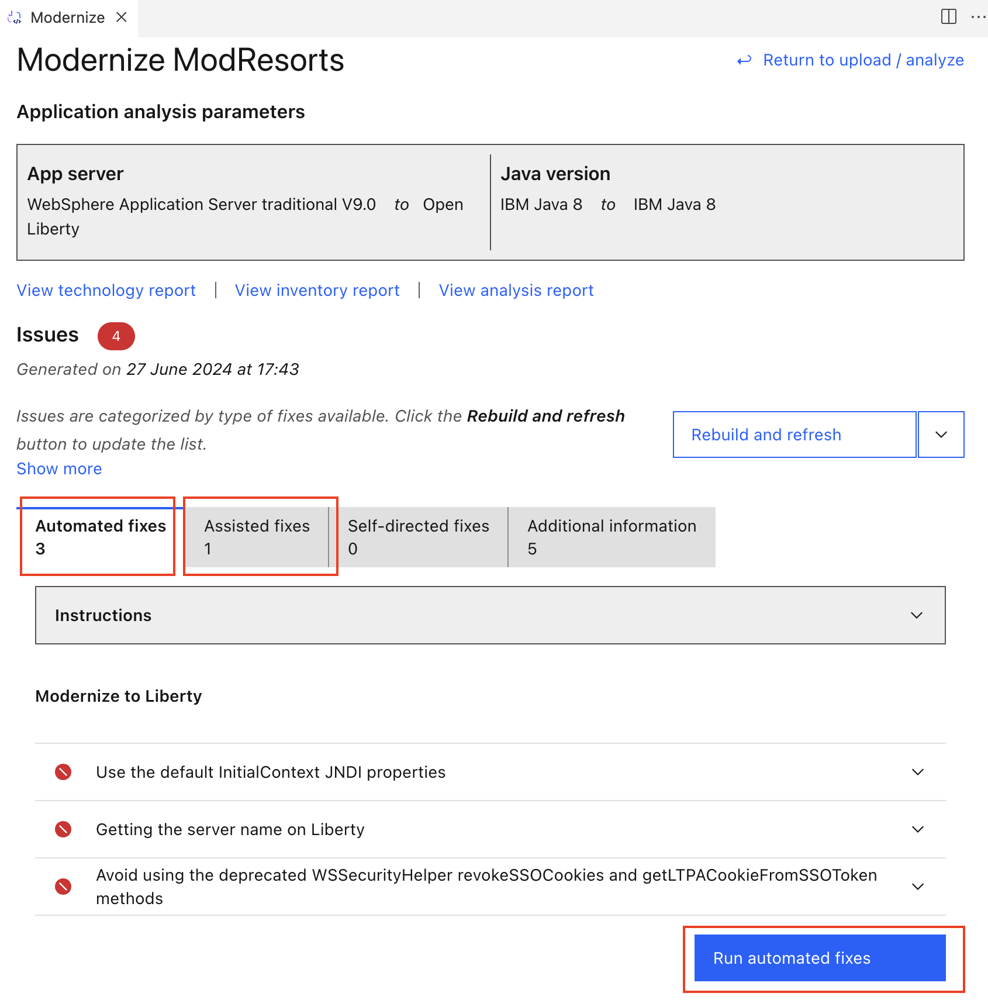
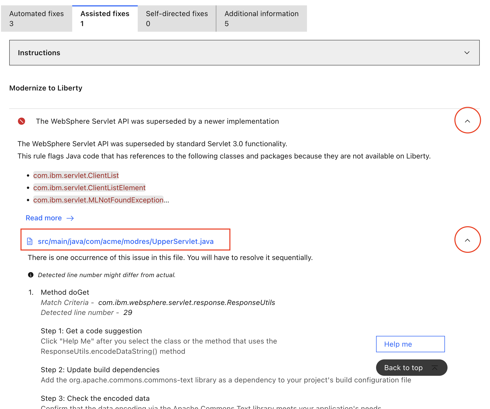
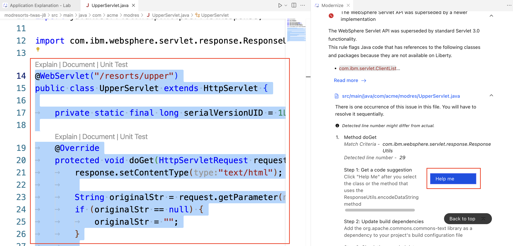
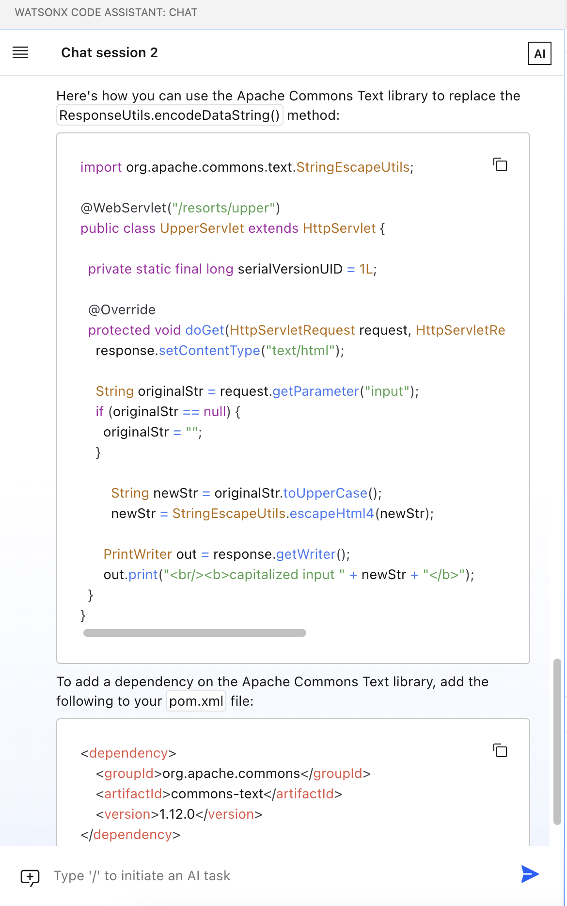
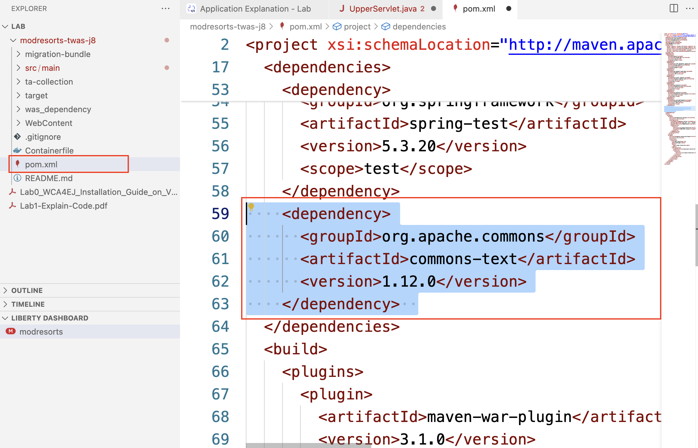
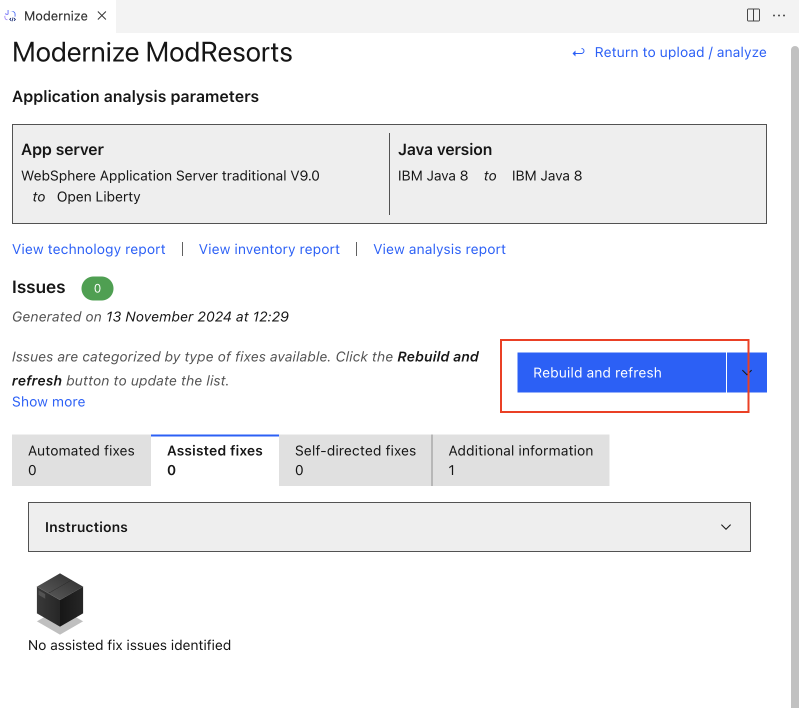
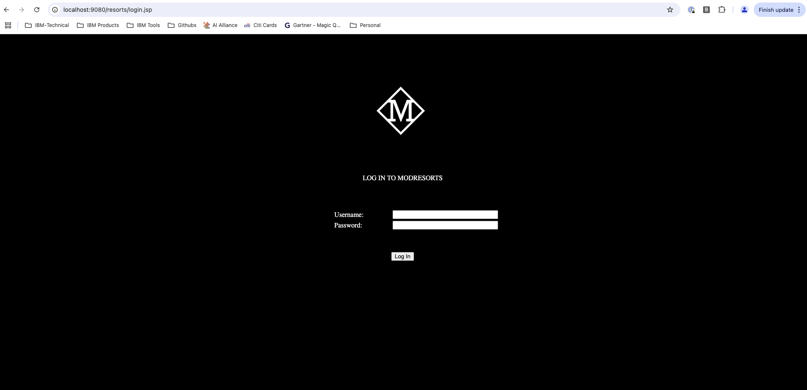

# Lab2: Code Modernization

This document gives step-by-step guide to finish Lab2.

## Lab2 covers:

- Modernize code from WebSphere to Liberty

### 1. Application analysis

Right click on the `modresorts-twas-j8` folder and select `watsonx Code Assistant` - `Modernize to Liberty`.

A `Modernize` tab will show up. Click `Upload migration bundle`, and select the file in our code asset `modresorts-twas-j8/migration-bundle/modresorts.ear_migrationBundle.zip`

Select both files to be included and `Proceed`.

After analysis, the report will show you issues with this application to be fixed. 3 of them can be automated, 1 of them needs assistance. For the automated fixes, we click `Run automated fixes`.

### 2. Apply Fixes

For the assisted fixes, you can click the `Instructions` dropdown to see the step which we will guide you. Now we expand the dropdowns of the issue as shown. There are clear instructions on how to fix this issue at the bottom.

Now we click the name of the file that has issue and needs to be fixed. In the editor window, we select the entire class defined in here that uses the `ResponseUtils.encodeDataString()` method by highlighting. Then we click `Help me` to ask help from LLM.

The chat with model window will show up and ask model for help. The model gives suggestions for fixing the issue.

There are 2 action items here. 
- First need to change the code in the `UpperServlet.java` file using the copy code from chat.
- Second need to update `pom.xml` to reflect the dependency.

### 3. Rebuild Application

Now that we have all the fixes applied. If your `modresort` application is still running, please stop it by going to `TERMINAL` and `CTRL+C`. You can `Rebuild and refresh` to see that there are no more issues with the application.

We can go to browser to view the new application. This time you will find that the `Logout` button is fixed.

