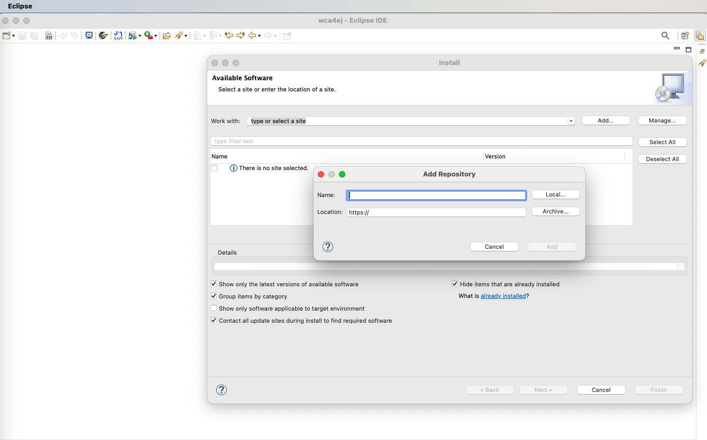
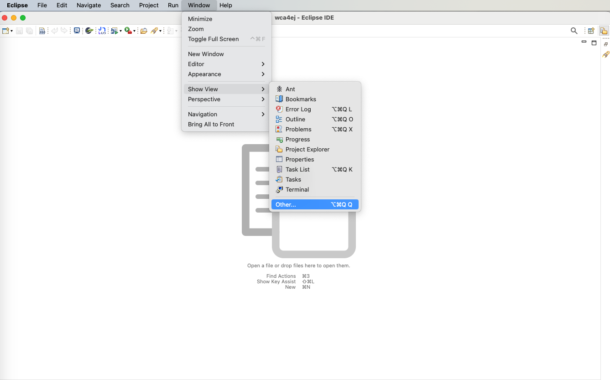
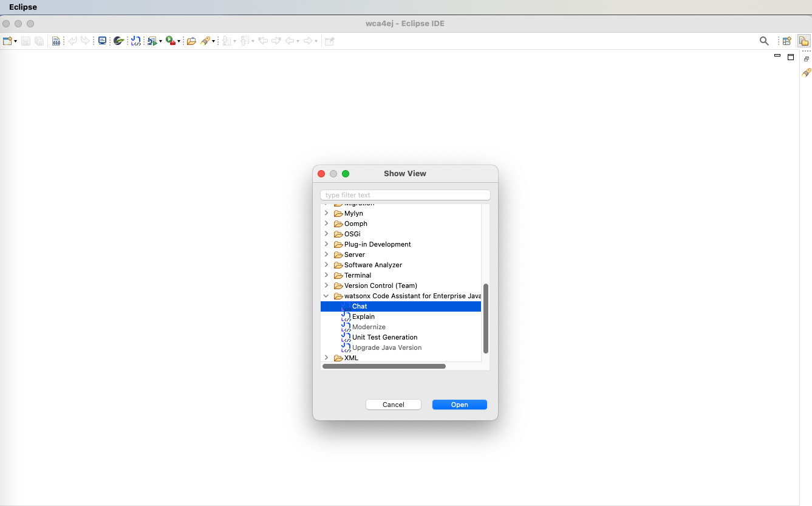
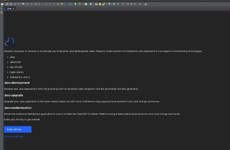
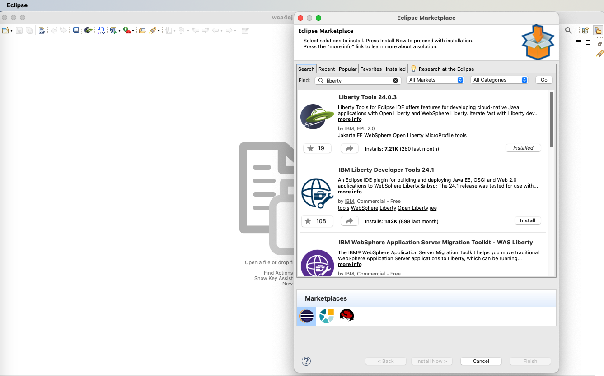

# WCA4EJ 安裝指示

本文檔提供安裝運行 ***Watson Code Assistant For Enterprise Java*** **(Wca4ej)** 有關的所需軟體工具/IDE  
## 环境设定

### 1. 安装 Java 

请应用这个链接，安装 JAVA21。[Download Java](https://www.oracle.com/sg/java/technologies/downloads/)
> 注意：安装Java之後，請把java加入`PATH`變數並設定`JAVA_HOME`也引入環境變量

### 2. 安裝 Maven

- Windows
    - 請瀏覽Maven官方網頁: [Maven Download Page](https://maven.apache.org/download.cgi)
    - 在 "Files" 下, 請點擊binary zip archive link (e.g., apache-maven-x.x.x-bin.zip). 
    - 將zip 檔案解壓縮到您選擇的位置 e.g., C:\Program Files\Apache\maven.
    - 將 Maven 加入PATH 並 Set MAVEN_HOME 環境參數 
- Mac
   - 請用homebrew安裝Maven

### 3. 安裝 Eclipse

Eclipse 用戶必須安裝一下其中一個版本:
   - Eclipse IDE for Java Developers 
   - Eclipse IDE for Enterprise Java and Web Developers 

以下是下載eclipse安裝配套的連接(請選擇其中之一)：
- [Eclipse 2024-03](https://www.eclipse.org/downloads/packages/release/2024-03/r)
- [Eclipse 2023-12](https://www.eclipse.org/downloads/packages/release/2023-12/r)

### 4. 下載 Wca4ej 插件

請根據網頁上的步驟下載並安裝最新的WCA4EJ Code Eclipse Extension: [Wca4ej Extension](https://ibm.box.com/s/o26ggaar57eh61m2t4ndvx84s31zho3v)

Windows系統的插件需要配合[Microsoft Edge WebView2 runtime](https://developer.microsoft.com/en-us/microsoft-edge/webview2/?form=MA13LH)。 此軟件可能已在較新的Windows版本內裝置.

### 5. 安裝 Wca4ej 插件

在 **步驟 4** 下載插件之後，請根據以下截圖，應用Eclipse安裝wca4ej

選擇主機套件或給予在**步驟 4** 下載檔案的行逕

安裝成功之後，請從新啟動IDE. 從新啟動後，請按照截圖找到此選擇

請根據截圖，選擇Watson code assistant for enterprise java

之後，您會看到截圖內的畫面[API 鎖會在workshop當天發出].

### 6. 安裝Liberty工具

請到 Eclipse Market Place, 安裝有關liberty工具 [Help >> Eclipse Marketplace]

得到API鎖之後，您可以開始使用wca4ej。

