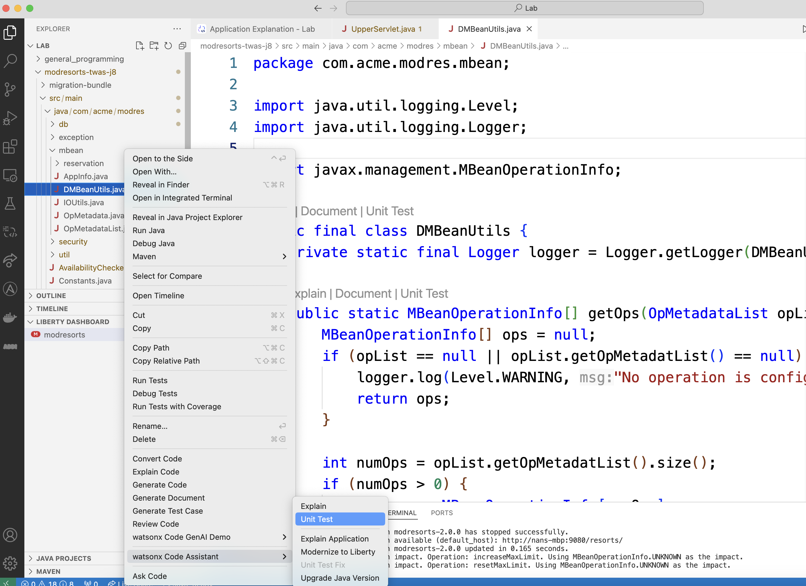
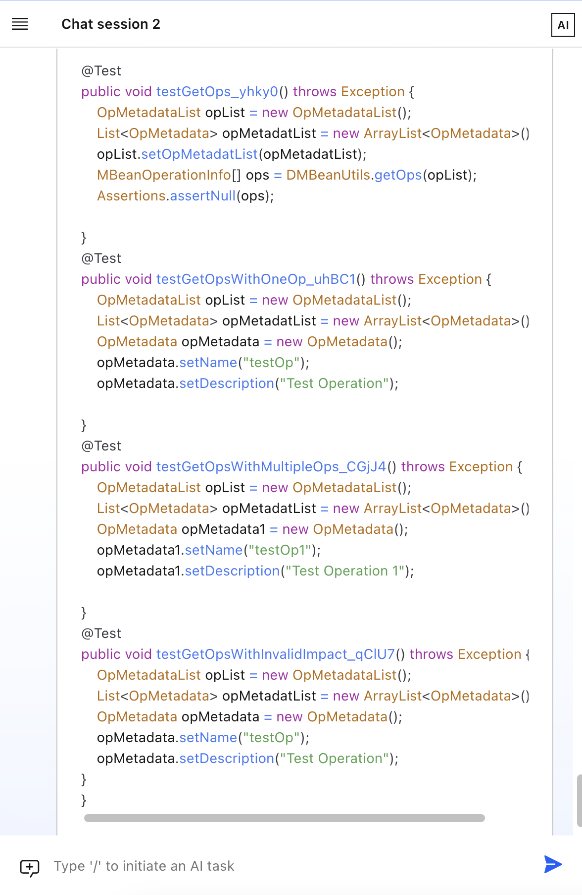

# Lab4: Unit Test Generation

This document gives step-by-step guide to finish Lab4.

## Lab4 covers:

- Gemerate unit test cases

### 1. Gemerate unit test for a given script

Right click on the any file, for example the ``

The chat session will show again with the generated test cases.

Right click on the any file, for example the ``

