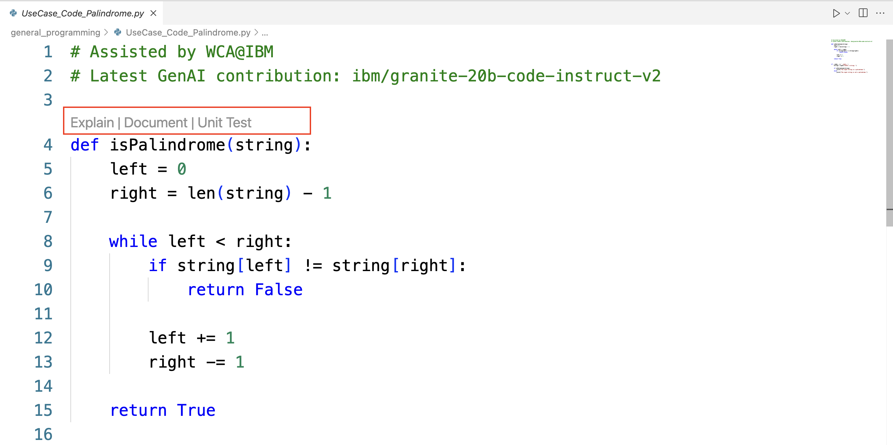
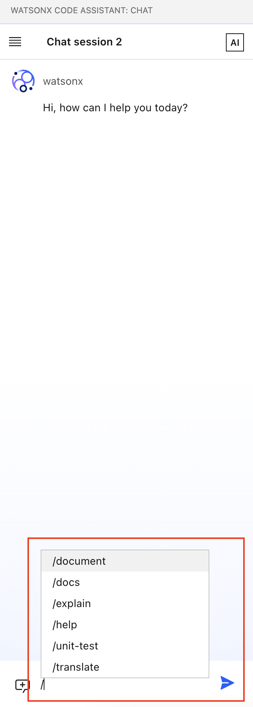
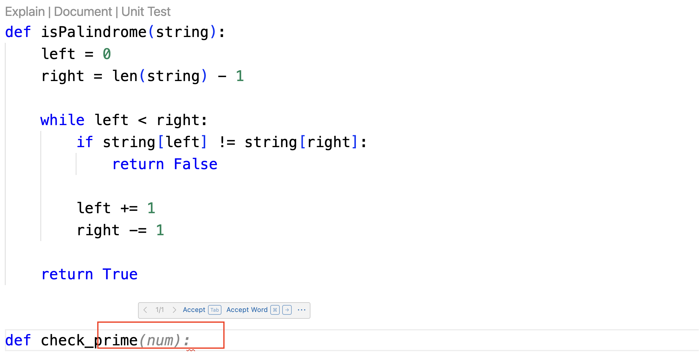
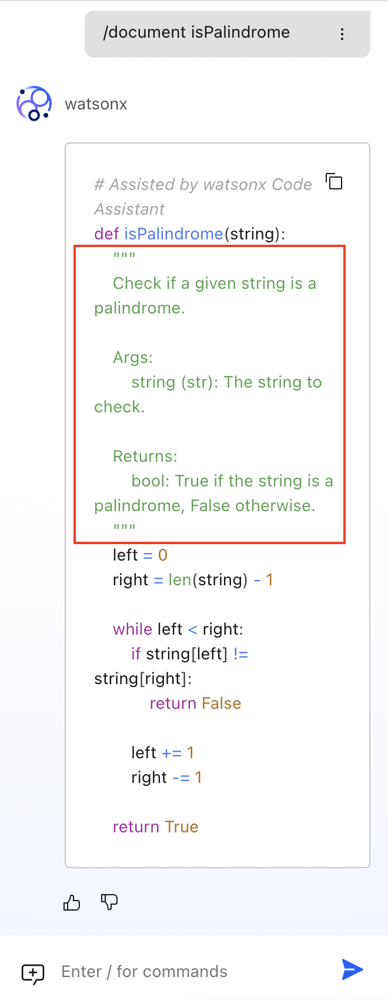
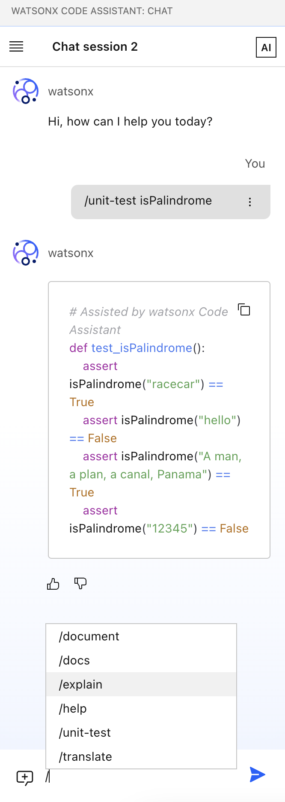

# Lab5: General Programming

This document gives step-by-step guide to finish Lab5, but feel to add in a few of your own attempts.

## Lab5 covers:

- General programming with other languages, including
    - code auto completion
    - code explanation
    - code documentation
    - unit test generation
    - code translation

To get started, you can preview options for general programming capabilities in any inline functions.



They align with options starting with backslash provided in the chat window.




### 1. Code Auto Completion

When developers write code, WCA will provide real-time inline suggestions.



### 2. Code Explanation

WCA can help explain the details and functions defined in the code sample.

### 3. Code Documentation

WCA can help generate documentation strings for a given code sample.



### 4. Unit test generation

Similar to what we see for Java, unit test generation is available for other languages.



### 5. Code Translation

Code translation is provided via the following syntex:

```
/translate [from SOURCE_LANGUAGE] to TARGET_LANGUAGE @REFERENCE_FILE|CODE_SNIPPET
```

