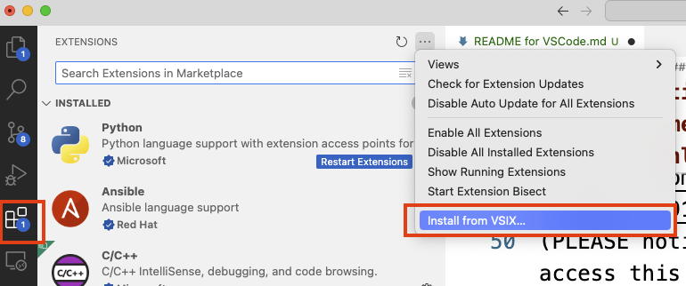
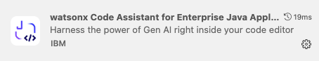
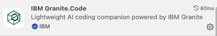
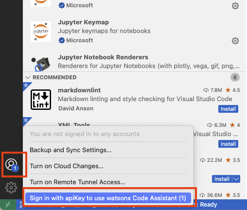
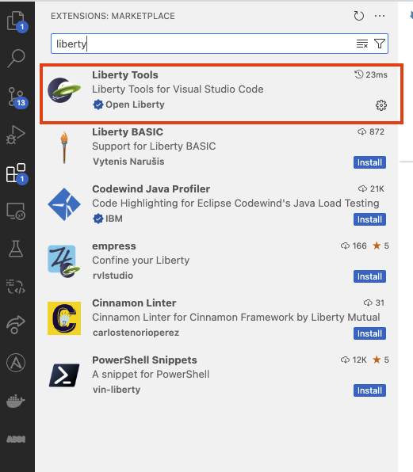
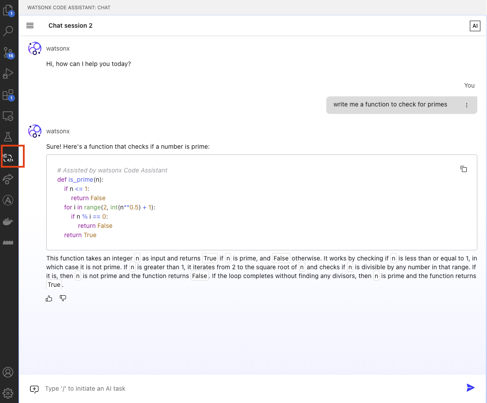

# Installation guide for WCA on VSCode

This document gives infomration on installing software tools with IDE VSCode that are needed to run ***Watson Code Assistant For Enterprise Java*** **(WCA4EJ)**

Last updated: Nov 13th, 2024

## Environment setup 

### 1. Java installation

#### Install Java21 using this link [Download Java](https://www.oracle.com/sg/java/technologies/downloads/)
- After installing java, add java to `PATH` variable and set `JAVA_HOME` envitonment variable
- Check if Java is installed properly:
```bash
java --version
```

### 2. Install Maven

- Windows
    - Visit the official Maven website: [Maven Download Page](https://maven.apache.org/download.cgi)
    - Under "Files", click on the binary zip archive link (e.g., apache-maven-x.x.x-bin.zip). 
    - Extract the zip file to a location of your choice, e.g., C:\Apache\maven.
    - Add Maven to PATH and Set MAVEN_HOME variable 
- Mac
   - Install maven using homebrew
```bash
brew install maven
```

Check if maven is installed properly:
```bash
mvn --version
```


### 3. Install VSCode

- [VSCode Official Website](https://code.visualstudio.com/download) for installation


### 4. WCA4EJ API Key

As of now, API Key will be provided by IBMers. Please reach out to IBMers for help on this.


### 5. Download WCA4EJ extension

Download the latest WCA4EJ Code VSCode Extension: [WCA4EJ Extensions](https://ibm.box.com/s/aznj47sm8g4lorhei4vszgovm6zvecg0)
(PLEASE notify IBMers if you cannot access this link).

- `wca-for-eja-1.0.0-20241113_1118.vsix`
- `wca-core-1.0.26.vsix`

### 6. Installing Wca4ej extension


#### After downloding the extension from **Step 5**, install the WCA4EJ using VSCode by 

- nevigating to extension tab and **install from VSIX** 



- select the WCA4EJ drivers downloaded `wca-for-eja-***.vsix`
and click install.



- repeat the same for `wca-core-***.vsix`



- restart VSCode if necessary

- Login with WCA4EJ API Key at the bottom left corner of VSCode. After successfully signed in, the number indicator should be gone.



- If you encoutner issue during autherization that says **"administrator needs to associate you with a deployment space"**, please reach out to IBMers to setup deployment space again for your API Key. 


### 7. Installing Liberty Tools and Java Extension

Install the Liberty Tools and extension Pack for Java extensions from VSCode marketplace as shown below.




### 8. Start Using WCA4EJ

You can check by navigating to the **watsonx Code Assistant** tab if your API Key is setup correctly by opening the chat window of WCA4EJ and chat with the model.


